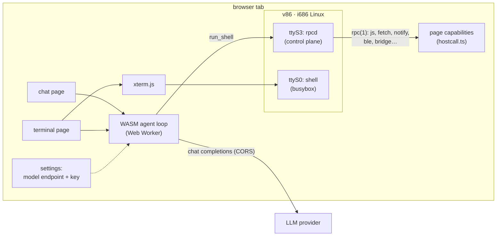

# vinx

[](https://github.com/shinnosuke-lab/vinx/actions/workflows/ci.yml)
[](https://github.com/shinnosuke-lab/vinx/actions/workflows/release.yml)

An LLM agent and a Linux machine, both running entirely in a browser tab.

The agent's tool-calling loop is [agent-core](#upstream) compiled to
WebAssembly. The machine it operates is a real i686 Linux — a Buildroot kernel
and a busybox userland — emulated by [v86](https://github.com/copy/v86). There
is no server: open the page from any static host (or `file://`) and you get a
chat agent that can run shell commands, plus a `/terminal` console into the
same machine. The model provider is called straight from the browser; nothing
you type leaves for a backend of ours, because there is no backend of ours.



Two serial lines carry the traffic. `ttyS0` is the person's console: xterm.js
on the `/terminal` page is wired straight to it, and busybox's own shell does
the line editing, history and Tab completion. `ttyS3` is the control plane —
JSON-RPC frames between the page and `rpcd` in the guest, both directions: the
model's `run_shell` rides it one way, and the guest's own CLIs (`js`, `fetch`,
`notify`, `ble`, `bridge`...) call page capabilities the other way, via
`rpc(1)`. The model and the person are operating one machine, and a file the
model writes is there at the prompt.

## Quick start

```bash
# 1. The Linux images (once; needs Docker). Produces web/app/public/vm/.
./linux/build.sh

# 2. The page.
cd web
(cd vendor/ui && npm ci && npm run build)   # the chat UI, its own npm project
npm install
npm run build:wasm                          # Rust engine -> wasm (needs the Rust wasm toolchain)
npm run dev                                  # or: npm run build && npx serve dist
```

Open the dev server, enter a model endpoint and key in settings (any
OpenAI-compatible provider that sends CORS headers — DeepSeek and Zhipu GLM
both do), and ask it to run something. The first command boots the VM; give it
a few seconds the first time.

If you only want to hack on the page and not rebuild Linux, the prebuilt images
under [`web/app/public/vm/`](web/app/public/vm) are all `npm run dev` needs.

### The Rust wasm toolchain

`npm run build:wasm` needs `wasm-pack`, the `wasm32-unknown-unknown` target, and
a `wasm-bindgen` CLI whose version matches [`web/Cargo.lock`](web/Cargo.lock)
(`wasm-pack` runs with `--mode no-install`, so it will not fetch one itself).
[`web/deploy/ci.sh --docker`](web/deploy/ci.sh) does the whole build inside a
container that carries all of it (build the image with
[`web/docker/build-image.sh`](web/docker/build-image.sh)), which is the
reproducible path if you would rather not install the toolchain. On a Linux
x86_64 host — the GitHub Actions runner — `ci.sh` fetches whichever of the
pinned tools is missing on its own.

## Layout

```
version.sh                name, version, model defaults (see the warning inside)
LICENSE                   MIT

linux/                    the guest Linux, built with Buildroot in Docker
  build.sh                ./linux/build.sh -> web/app/public/vm/{bzImage,rootfs.img}
  Dockerfile              the Buildroot build environment
  external/               a Buildroot external tree
    configs/vinx_v86_defconfig
    package/              the tree's own packages: tcc, micropython-pylib, nes,
                          btmon (bluez's analyzer, shim-built), vinx-nasm,
                          vinx-lvgl (LVGL v9 as liblvgl.so), termbox2
    board/vinx/
      linux.fragment      kernel options: four 8250 UARTs, virtio-net, no SMP
      rootfs-overlay/     inittab (getty on ttyS0; rpcd/rund, the ttyS3
                          control plane), the guest's browser-facing
                          commands (usr/bin)

nes/                      a NES console spanning guest and page: agnes + a
                          homegrown APU, framebuffer, /dev/dsp sound, Lua
                          scripting; package/nes builds it into the image
                          as /usr/bin/nes (see nes/README.md)

skills/linux-vm/          the userland reference, shipped with the page

apps/                     the apps shipped with the page, one directory per
                          package as `app pack` takes it; web/build-apps.mjs
                          packs them, the page seeds them once per machine
  lasertyper/             a typing shooter for a tty window (termbox2, tcc)
  nes/                    the console's window: a ROM picker on a tty, the
                          image's /usr/bin/nes on the screen

deploy/cloudflare-wisp/   a serverless wisp relay: one Cloudflare Worker

web/                      the page: agent-core in wasm, its worker, the UI, the VM
  crates/agent-web-core/  Rust: the engine bindings and the browser host
  runtime/src/            the worker RPC, the fetch shim, the VM device seam
  app/                    the pages themselves
    main.tsx              the chat page
    terminal.tsx          the /terminal console (xterm.js on ttyS0)
    vm.ts                 the v86 lifecycle, the serial bridge and the
                          ttyS3 control link (rpc.ts frames, hostcall.ts
                          methods)
    net-bridge.ts         the WebRTC LAN bridge (room codes, manual pairing)
    run-shell-tool.tsx    the run_shell tool card
  vendor/                 vendored agent-core engine + chat UI (see UPSTREAM.md)
  deploy/                 build/test scripts -- see web/README.md
  docker/                 the wasm build image
```

## How the pieces talk

- **The console → the VM.** `web/app/terminal.tsx` opens an xterm.js terminal
  and pipes its bytes to `ttyS0` through `web/app/vm.ts`. It is a dumb terminal
  on purpose: the guest's getty and shell do everything a shell does.
- **The agent → the VM.** The engine runs in a Web Worker and thinks its tools
  are an HTTP device. `run_shell` calls are POSTed to an internal address the
  worker's own `fetch` intercepts and bounces to the main thread
  (`web/runtime/src/worker.ts`), where `web/runtime/src/device-vm.ts` runs them
  as `proc.run` over the ttyS3 control plane and returns `{ok, output,
  exit_code}`.
- **The VM → the page.** The guest's CLIs (`js`, `fetch`, `notify`, `say`,
  `camera`, `open`, `download`, `ble`, `bridge`) are `rpc(1)` calls the other
  way over the same link: `rpcd` forwards them to the page, which serves them
  as methods (`web/app/hostcall.ts`) — fetch from the page's origin, speak,
  notify, Web Bluetooth, the WebRTC bridge. Errors come back named instead of
  vanishing, and the commands work under `run_shell` too, not just at the
  console.
- **The agent → the model.** Everything under `/api/*` that the chat UI expects
  from a server is answered inside the page by the fetch shim
  (`web/runtime/src/shim.ts`); the only real network request is the engine's
  own call to the model endpoint, which is why that endpoint must send CORS
  headers.
- **Sessions** live in the browser (SQLite in IndexedDB), not anywhere else.

## The tools

The device is the VM, and its tool surface is a small set of operations on
that Linux rather than a bare shell (`web/runtime/src/device-vm.ts`):

- `read_file` / `list_dir` — strictly read-only by construction, so they run
  **without** the confirmation gate; exploration stops costing a click each.
- `write_file` / `edit_file` — file changes with exact content transfer (no
  busybox quoting traps); gated.
- `run_shell` — everything else: `sh -c` as root, output capped at 64 KiB.
  Gated behind the same approval prompt agent-core uses for anything
  dangerous, and `/auto` turns the gate off for a session, knowingly.
- `download_file` — hands a file (≤16 MB) to the person as a browser
  download: the way compiled binaries get out of the VM. Files go the *other*
  way by dropping them onto the terminal (or its footer's file button); they
  land in `/data`.
- `read_terminal` (terminal page only) — the last lines of the person's own
  screen, so "look at this error" does not mean pasting it.

Exact file bytes ride through `/data`'s 9p lane rather than the serial
channel (which truncates at 64 KiB). What the model knows about the userland
it is driving is [`skills/linux-vm/`](skills/linux-vm), not the system prompt:
busybox is not GNU coreutils, the machine is RAM apart from `/data`, and what
the network can do depends on which mode is live. The page installs that skill
into its own workspace on first load; a skill is read on the turns that need
it, where prompt text is paid for on every request.

## The machine

An i686 with 128 MB of RAM, running busybox on musl. Beyond the shell there is
`curl` (TLS-capable, CA bundle included), and enough to actually program with:
`tcc` compiles real C on the target (musl and kernel headers ship in the
image) and GNU `make` drives it for multi-file projects, `lua` is standard
Lua 5.4 with `liblua.so` and headers installed — so tcc can embed a scripting
engine (`tcc host.c -llua`) or compile C modules for it (`tcc -shared`) — and
`micropython` (plus micropython-lib's pure-Python add-ons: datetime, pathlib
and friends) and `qjs` (QuickJS) cover Python- and JavaScript-shaped
scripting. Assembly is native, not an exercise: `nasm` assembles Intel syntax
(`nasm -f elf32 x.asm && tcc x.o -o x`), `ndisasm` reads binaries back, and
`strace` shows the syscalls when something misbehaves. For data there are
`sqlite3` — the CLI, and the library with its header, so `tcc app.c
-lsqlite3` just links — `jq` for JSON on the shell, and `btmon` to decode
btsnoop Bluetooth captures offline. There is a GUI runtime too: LVGL v9 as
`liblvgl.so` with headers, so `tcc gui.c -llvgl` puts widgets on the VGA
screen, with the mouse forwarded from the page's screen window (PS/2 →
evdev) — `lvdemo` compiles and runs the shipped example in the machine
itself, and a full GB2312 Chinese font ships at `/usr/share/fonts/cjk16.bin`,
ready for `lv_binfont_create`. Terminal UIs get
`ncurses` (with headers) and `termbox2` (single header, tcc-friendly).
All of it fits in a ~13 MB compressed
initramfs (about 36 MB unpacked in the VM's RAM). The whole pipe is UTF-8 — type 中文 at the prompt,
name files with it, `ls` shows it (busybox is built with Unicode line editing
and width tables; the terminal measures CJK and emoji with the Unicode 11
tables). `vi` is a real vim (runtime-less, so no syntax files, but native
multibyte — editing Chinese doesn't shear the screen the way busybox vi did).

The machine also talks back to the browser it lives in, through the small
commands the boot banner lists (`share local FILE` is described with `/data`
below):

- `open FILE|URL` — macOS-style: the browser renders what it can (PDF, HTML,
  images, video, text) in a new tab and downloads the rest.
- `imgcat [-w WIDTH] FILE` — the image, inline in the terminal (iTerm2's
  protocol). Auto-fits by default — small images at their own size, big ones
  scaled down to fill the viewport whole; `-w 60`/`-w 50%`/`-w 800px` pins
  the width in cells, viewport share, or pixels (1:1). Inline images are
  anchored to the character grid they were drawn on, so shrinking the window
  or splitting the screen afterwards clips them — rerun imgcat to redraw, or
  `open` the file for a full-size look in a browser tab.
- `download FILE` — a browser download, no questions asked.
- `js -e CODE` and `fetch URL` — the page, callable from the shell: `js`
  runs JavaScript on the hosting page itself (DOM, browser `fetch`), and
  `fetch` is HTTP through the browser with zero network setup (CORS
  applies). Both also work from the agent's channel.
- `notify`, `say`, `camera` — a browser notification, the tab speaking
  through speech synthesis, a webcam frame as a file.
- `microcom /dev/ttyS2` — a real serial device wired in from the footer's
  serial chip (Web Serial).
- `ble scan|connect|read|write|notify` — Web Bluetooth: the page speaks GATT
  to a device the person picks, the shell reads, writes and subscribes.
- `fbdemo` — paints `/dev/fb0`; the footer's screen chip shows the
  framebuffer in a floating window.
- `nes ROM.nes` — a NES console on that same screen, full speed with sound,
  scriptable in Lua ([`nes/`](nes)). Ships in the image as `/usr/libexec/nes`
  behind a small wrapper. All framebuffer programs (`lvdemo`, `fbdemo`,
  `nes`, your own) go through `fb-run`: one FB program at a time (an flock
  that dies with the process, `kill -9` included), and the console's termios
  come back sane on every exit path.
- `bridge start|join CODE|say WORDS` — one LAN across browsers, below.
- `rpc call|notify|discover|watch|serve` — the control plane from the
  shell; `rpc watch [TOPIC...]` prints events (`app.exited`,
  `window.closed`, ...) as they happen, one line each, and
  `rpc serve ext.myapp.method -- ./handler` makes a shell script callable
  by everything else on the machine (and by the page): params arrive on
  the handler's stdin, its stdout is the result, and the registration
  dies with the process.
- `app new|check|pack|install|run|start|stop|enable|list|log` — make and run
  apps on this machine: scaffold a work tree (`--command`, `--service`,
  `--web`, `--tty` or `--fb`), validate it (`--json` speaks a stable error
  shape a model can fix against), pack it into a `.vapp` (a plain tar.gz),
  install it into
  `/data/apps` (validated, atomic), and run it — once in the foreground, as
  a service supervised by `rund` (own process group, log under
  `/run/vinx/apps/`, bounded crash restarts; enabled services autostart on
  every boot), or as a **web window**: `index.html`/`style.css`/`app.js`
  render in a floating window on the page, inside a sandboxed iframe with
  a locked-down CSP — the app cannot touch the page's DOM, its storage or
  the network, and talks to the desktop only through a small allowlisted
  bridge. A hybrid app pairs that window with a Linux backend; closing the
  window stops the backend. A **tty app** (`--tty`, termbox2 scaffold) gets
  a real PTY and a floating xterm window on the page — keystrokes ride down,
  the app's screen rides up (a byte mux on its own serial lane, so a
  firehose of output never delays a control call) — and an **fb app**
  (`--fb`, LVGL scaffold with a Chinese label out of the box) draws on the
  machine's screen under the `fb-run` lock.
- `alpine` — downloads Alpine's ~3.5 MB minirootfs (needs a relay network),
  chroots in, and hands you `apk`: a real package manager with a 32-bit x86
  repository, everything RAM-resident and gone on reload.

Everything is RAM and vanishes on reload — except `/data`. That directory is
a 9p filesystem whose bytes live on the page side: drop a file onto the
terminal (or use its footer's file button) and it lands there; the page
mirrors the tree into IndexedDB — recursively, incrementally on a size/mtime
fingerprint, nudged by the emulator's own 9p write event so guest writes
usually persist within a couple of seconds — and replays it on the next
boot, directories, executable bits and all. So `/data` is where work
survives, everything else is honest about being a fresh machine. Files
deleted inside the VM stay deleted after a reload; work done in the final
seconds before closing a tab may miss the last snapshot; dot-named scratch
(`.vinx/` and friends) and the `host/` mount stay out of the archive by
rule. A 64 MB / 2000-file quota per machine keeps the mirror (and the page)
from growing without bound — past it, persistence pauses and the terminal
says so.

`/data` is private to its machine, with one shared spot inside it:
`/data/share/local` holds the same files on every machine the person has open
on this origin — the chat page's VM, each split pane's, other tabs'. Chat
attachments land there, `share local FILE` (or the model's `share_local`
tool) copies a file in, and the pages keep each other in step over a
BroadcastChannel — browser-local mirroring, nothing over the network. The
`local` in the name is the point: a future relay-backed `share net` would be
the one that crosses systems.

The terminal page can also **split**: the header's split buttons add a second,
fully independent Linux beside (or below) the first — separate filesystems,
separate `/data` mirrors (`/data/share/local` excepted), separate AI panels,
one browser-side LAN between them. Each machine costs its own ~130 MB, which
is why the second one starts only when asked for and the ceiling is two.

## The network

Pick the mode in the page's network control — the terminal footer's `net:` chip
or the chat page's floating `net:` button — no scripts, no URL editing. The
console and the tool channel are serial, not network, so they work in every
mode. Inbound sockets never work in any mode. `ping` is honest only inside a
shared segment (Host, Bridge, Relay — the peer's kernel answers for real);
under Internet (wisp) and `fetch` every reply is forged locally and proves
nothing.

**Default — Host LAN, no server anywhere.** VMs in your tabs join one
browser-internal L2 segment (v86's BroadcastChannel hub): each gets a
`10.0.2.x` address and they can `ping`/`nc`/serve to each other, but nothing
reaches the internet. Split the terminal (or open two tabs) to see two
machines network. Zero backend, zero risk — which is why it is the default.

**Bridge LAN — the same segment, joined to friends' over WebRTC.** The same
in-browser hub, plus a bridge to other people's machines: every VM on both
sides shares one ethernet segment — `ping`, `nc`, `httpd` across the
internet — and `bridge say` floats chat messages across every bridged screen
as an overlay. One host, many joiners (the host's tab switches frames
between them). *Hidden from the panel by default:* WebRTC between arbitrary
home networks proved too flaky to sell as a mode (AP isolation and mDNS
candidates fail even on one router). The guest CLI (`bridge start`,
`bridge join CODE`) still works everywhere, and setting
`localStorage['vinx.bridge.ui'] = '1'` brings the panel surfaces back. Two
ways to carry the handshake, neither carrying any traffic:

- **Room code (default):** hosting mints a six-letter code; friends type it
  (`bridge join CODE` at their prompt, or in their panel). The sealed SDP
  handshake travels through public Nostr relays, a STUN server discovers
  each side's address, and the connection itself is peer-to-peer.
- **Manual:** no relays at all — the pairing codes are strings you carry
  yourself (chat, email), one friend at a time. The result is the same
  room, roster and `say`.

**Relay LAN — one shared segment through a wsproxy, plus the internet.**
A `ws(s)://` address selects v86's wsproxy backend: an L2 ethernet-frame
relay. *Everyone* connected to the same server lands on one virtual segment —
machines see each other, like `Host LAN` but spanning strangers — and the
server NATs them out to the internet. v86's own public relay,
`wss://relay.widgetry.org/`, is prefilled in the panel, and the terminal's
first visit offers it once as the one-click way online. The guest's address
comes from the relay's DHCP and lands a few seconds after boot — the network
is ready once `ip route` shows a default route. Machines reach each other at
those DHCP addresses (`ip -4 addr show eth0`; on the public relay a
`10.5.x.x`): the self-assigned `10.0.2.x` alias does not cross this relay —
the server drops source addresses it never leased. Two honest caveats
about a public relay: unknown machines share your segment, and the in-page
`bridge`/`say` features ride the in-browser hub, so they don't run here.
Running your own is one Docker command (wsnic) — see
[`deploy/self-host.md`](deploy/self-host.md).

**Internet — pure outbound TCP over a wisp relay you run.** A `wisp(s)://`
address selects the Wisp backend, which carries only TCP/UDP payloads, client
to server: the guest gets `curl https://...`, WebSocket and raw TCP, and
nobody on the relay ever sees anybody else. Run one yourself:

```bash
./web/deploy/relay.sh                     # local: wisp://127.0.0.1:5001/
./web/deploy/relay.sh --tunnel            # + a free Cloudflare quick tunnel
```

`relay.sh` runs MercuryWorkshop's wisp-js and prints the address to paste;
`--tunnel` also exposes it publicly via a `trycloudflare.com` quick tunnel (no
account). The same server as a non-root Docker container — plus security
notes for both relay flavors — is in
[`deploy/self-host.md`](deploy/self-host.md). For a permanent, serverless
relay there is a ~200-line Cloudflare
Worker in [`deploy/cloudflare-wisp/`](deploy/cloudflare-wisp) (deploy it to
**your own** account — free — with one caveat: Workers block outbound TCP to
Cloudflare's own IP ranges, so sites behind Cloudflare are unreachable through
it). The project ships no wisp relay of its own on purpose: a default one
would be an open proxy for every visitor.

There is also a legacy `fetch` mode (`?relay=fetch`): outbound plain HTTP
replayed as browser `fetch()`, reachable only for http endpoints that send
permissive CORS headers, no TLS — kept for compatibility, not offered in the
control.

## Rebuilding the Linux images

[`./linux/build.sh`](linux/build.sh) runs Buildroot inside Docker (Buildroot
only builds on Linux) and drops `bzImage` and `rootfs.img` (a gzipped cpio —
the neutral extension keeps static servers from serving it with
`Content-Encoding: gzip`, which would triple the initrd in flight) into
`web/app/public/vm/`. The first build compiles a cross-toolchain and a kernel
and takes a while; the download cache and build tree live in Docker volumes, so
later builds are incremental. `--clean` drops the build volume;
`--shell` opens a shell in the build container.

To change what is in the machine — add packages, files, kernel options, or
your own Buildroot package — see the recipes in
[`linux/README.md`](linux/README.md); everything project-specific lives in the
external tree under [`linux/external/`](linux/external). The control plane is
a pair of small C daemons in
[`linux/external/package/vinx-rpc/`](linux/external/package/vinx-rpc) — `rpcd`
owns the ttyS3 wire and the method routing, `rund` executes `proc.run` jobs —
with `rpc(1)` as the shell's way in; the protocol lives in
[`docs/system-v2.zh-CN.md`](docs/system-v2.zh-CN.md) §6.

## Releasing

Releases are cut by tag; pushes to `main` only run the quality gate
([`ci.yml`](.github/workflows/ci.yml) runs
[`web/deploy/ci.sh`](web/deploy/ci.sh) — every suite including the E2E leg
that boots the VM — and deploys nothing). To publish:

```bash
# 1. Set the version. version.sh is the single source of truth; the tag
#    must match or the release fails its consistency check.
$EDITOR version.sh            # VER=0.2.0

# 2. Commit, tag with the same number, push both.
git commit -am 'release 0.2.0'
git tag v0.2.0
git push && git push --tags
```

The `v*` tag triggers [`release.yml`](.github/workflows/release.yml): it
builds, runs the full suites, and only if everything is green deploys
`web/dist` to GitHub Pages and creates a GitHub Release carrying
`vinx-X.Y.Z-site.tar.gz` (the whole site, self-hostable on any static
host — the build uses relative paths, so any subdirectory works) and
`vinx-vm-images-X.Y.Z.tar.gz` (the `bzImage` + `rootfs.img` pair, for
comparing against your own Buildroot output). The live site therefore always
corresponds to a named tag; to roll back, re-run the release workflow from an
older tag. Forks get all of this as-is after enabling Pages (repo Settings →
Pages → Source: GitHub Actions).

## Built on

Most of vinx is other people's work, arranged in a browser tab. The
load-bearing pieces by layer, with the licence each project declares
(versions are the ones pinned today — `web/package.json`,
`web/crates/agent-web-core/Cargo.toml`, `linux/external/package/*/*.mk`):

- **The page.** [v86](https://github.com/copy/v86) (BSD-2-Clause) is the
  x86 emulator the Linux runs on. [xterm.js](https://xtermjs.org) (MIT), with
  its fit, webgl, image, unicode11, web-links and clipboard addons, is the
  console. [React](https://react.dev) and [Vite](https://vite.dev) (MIT) build
  the page. [noble](https://paulmillr.com/noble/) hashes, ciphers and curves
  (MIT) do the crypto: Schnorr signatures and AES-GCM for the Nostr
  signalling that pairs two bridges, SHA-256 for the host-folder mount. The
  suites run under [Playwright](https://playwright.dev) (Apache-2.0).
- **The chat UI** (`web/vendor/ui`, part of the agent-core fork below) stands
  on [Radix UI](https://www.radix-ui.com) (MIT),
  [Tailwind CSS](https://tailwindcss.com) (MIT), [lucide](https://lucide.dev)
  (ISC), [react-markdown](https://github.com/remarkjs/react-markdown) with
  remark-gfm and rehype-highlight (MIT), [highlight.js](https://highlightjs.org)
  (BSD-3-Clause), [Mermaid](https://mermaid.js.org) (MIT),
  [DOMPurify](https://github.com/cure53/DOMPurify) (MPL-2.0 or Apache-2.0),
  [html2canvas](https://html2canvas.hertzen.com) (MIT), react-devicons (MIT),
  clsx and tailwind-merge (MIT), class-variance-authority (Apache-2.0).
- **The agent engine** (`web/crates/agent-web-core`) reaches the browser
  through [wasm-bindgen](https://github.com/rustwasm/wasm-bindgen), js-sys and
  wasm-bindgen-futures, and runs on [tokio](https://tokio.rs),
  [reqwest](https://github.com/seanmonstar/reqwest), serde (with serde_json
  and serde_yaml), futures, regex, zip (deflate via flate2), wasmtimer,
  base64, log, async-trait and console_error_panic_hook — each MIT and/or
  Apache-2.0.
- **The machine** is a [Buildroot](https://buildroot.org) 2025.02.9 image
  (GPL-2.0+, the build system only) for i686 on [musl](https://musl.libc.org)
  (MIT): [Linux](https://kernel.org) (GPL-2.0), [BusyBox](https://busybox.net)
  (GPL-2.0), [curl](https://curl.se) (curl licence) with
  [Mbed TLS](https://www.trustedfirmware.org/projects/mbed-tls/) (Apache-2.0)
  and Mozilla's CA bundle (MPL-2.0), [tcc](https://bellard.org/tcc/) 0.9.27
  (LGPL-2.1), GNU make (GPL-3.0), [Lua](https://www.lua.org) 5.4 (MIT),
  [MicroPython](https://micropython.org) with micropython-lib 1.22.2 (MIT,
  PSF-2.0), [QuickJS](https://bellard.org/quickjs/) (MIT),
  [SQLite](https://sqlite.org) (public domain), [jq](https://jqlang.github.io/jq/)
  (MIT), [NASM](https://www.nasm.us) 2.16.03 (BSD-2-Clause),
  [strace](https://strace.io) (LGPL-2.1), btmon from
  [BlueZ](https://github.com/bluez/bluez) 5.79 (GPL-2.0+), [Vim](https://www.vim.org)
  (Vim licence), [LVGL](https://lvgl.io) 9.3.0 (MIT),
  [termbox2](https://github.com/termbox/termbox2) 2.5.0 (MIT) and ncurses
  (MIT-X11).
- **The NES** (`nes/`) is built around [agnes](https://github.com/kgabis/agnes)
  0.2.0 by Krzysztof Gabis (MIT; vendored under `nes/vendor/` with one local
  patch, recorded in `VENDOR.txt` there).
- **The fonts.** `cjk16.bin`, the LVGL font in the image, is the GB2312
  repertoire of Droid Sans Fallback Full (Apache-2.0) plus ASCII from DejaVu
  Sans (Bitstream Vera licence);
  [`linux/external/board/vinx/fonts.md`](linux/external/board/vinx/fonts.md)
  has the recipe.

Two more are borrowed at run time rather than shipped, and are named where
they are used: the optional relay (`web/deploy/relay.sh`) runs
MercuryWorkshop's [wisp-js](https://github.com/MercuryWorkshop/wisp-js) (AGPL-3.0),
and the guest's `alpine` command downloads Alpine Linux's x86 minirootfs to
get `apk` and its package feed.

## Upstream

The agent engine and chat UI under [`web/vendor/`](web/vendor) are a **fork**
of `agent-core` (fork point recorded in
[`web/vendor/VENDOR.json`](web/vendor/VENDOR.json)), edited directly like any
other code in this repository — there is no sync script and no patch layer.
See [`web/docs/UPSTREAM.md`](web/docs/UPSTREAM.md) for the fork's history,
what was taken, and what is reimplemented for the browser.

## License

MIT, see [LICENSE](LICENSE). Forked code under `web/vendor/` carries its
upstream terms.
