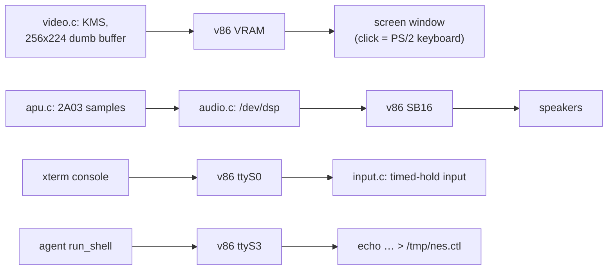

# nes -- a NES console for the vinx machine

A Nintendo Entertainment System living *inside* the browser-tab Linux: the
[agnes](https://github.com/kgabis/agnes) core (vendored under `vendor/`,
MIT) plus a homegrown 2A03 APU, mode-setting the Bochs DRM head to the
game's own 256x224 picture (the page's floating screen window pops open by
itself and scales it up pixel-perfect), sounding through `/dev/dsp` (v86's
SB16, straight into the tab's speakers), reading the console and the PS/2
keyboard, scripted by the Lua 5.4 that ships in the image, and playing
two-player over the LAN (`nes host` / `nes join`: lockstep netplay, the
joiner needs no ROM). The machine itself ships in the image too:
`linux/external/package/nes` cross-compiles these sources at -O2 into
`/usr/bin/nes`, comfortably past full NES speed.



## Quick start

```sh
# drop a .nes ROM onto the vinx terminal (it lands in /data), then:
nes /data/your-game.nes                # play, at full speed
```

Launching mode-sets the display, and the page opens the screen window on
it, sized to the biggest whole multiple of 256x224 that fits — every game
pixel an exact NxN block of screen pixels, and the TV overscan rows (the
top and bottom 8, scratch space to most games) already cropped, like every
television cropped them. Drag the window by the title bar, resize it by any
edge or corner (the picture rescales, snapping to whole pixels while it can),
maximize/restore from the title buttons (double-click works too), close to
tuck it away — the footer's **screen** chip brings it back, and geometry
sticks across reloads (localStorage). The machine renders — and sounds —
whether the window is open or not; quitting hands the display back to the
console.

The blit skips frames automatically when the clock slips; emulation itself
never skips, so games stay correct, just slower. Measure any machine:
`nes --bench 600 rom.nes`.

## Controls, two grades

- **Serial (always works):** type into the terminal while the game runs.
  A serial line has no key-release, so each keystroke *holds* its button
  for `hold_frames` frames (default 6, ~100 ms).
- **PS/2 (the real thing):** click the screen panel. While it is focused,
  game keys become scancodes on the emulated PS/2 keyboard and arrive
  through `/dev/input` with true press *and* release -- hold Right and
  Mario keeps running. Click the terminal to type there again; focus is
  the router.

Keys, both grades: arrows/WASD move, `K`/`X` = A, `J`/`Z` = B,
`Enter` = Start, `Space` = Select, `q` quits.

## Sound

agnes has no APU (upstream to-do), so `src/apu.c` is ours: the 2A03's two
pulses, triangle, noise and DMC to the NESdev spec, with the standard
non-linear mixer. The vendored bus dispatcher got exactly two hook lines
(`#ifdef NES_APU`, see `vendor/VENDOR.txt`); writes queue up with their CPU
cycle stamp and the frame's samples are synthesized in one catch-up pass at
frame end — 22050 Hz s16 mono into `/dev/dsp`, the kernel's OSS face on
v86's SB16, which the page feeds to the tab's AudioContext.

Sound is on when `/dev/dsp` exists and opens; failure quietly degrades to
a silent machine. And it is more than sound: once the small DSP buffer
fills, the **blocking write is the pacer** — the loop locks to the audio
clock at 60.1 fps instead of nanosleep (the E2E run holds 59.9).
`--no-sound` turns it off, `--wav FILE` dumps the mix (works with `--bench`
on any host: the off-target way to hear a ROM).

One trap outside this program entirely: ALSA brings the SB16 up with every
mixer control at zero, and the image ships no alsactl to restore levels —
for a while the machine played *perfect silence* while everything
measurable here (pacing, fps, a running AudioContext) looked healthy. The
image's `S25vol` boot script now turns master and PCM to 100 through
`/dev/mixer`; `vol N` is the knob if you want it quieter (see
`linux/external/package/vol`).

Honest omissions: no frame/DMC IRQs (a rare few games use them for split
timing), `$4015` reads report the previous frame's length counters, and
DMC fetches skip the real CPU stall cycles. Music and effects in the
mapper-0/1/2/4 library play fine.

## Netplay: two machines, one game

```sh
# machine A (P1) -- same page's split pane, or a friend after `bridge`:
nes host /data/game.nes         # prints the literal join line to copy

# machine B (P2) -- no ROM needed, none wanted:
nes list                        # who is hosting on this LAN, and what
nes join                        # one host: joins it; several: lists them
nes join 10.0.2.51              # or name it (the host's print / nes list)
```

Classic **lockstep**: both sides run the same deterministic core and
exchange nothing but controller bytes over one TCP connection — each frame
a few dozen bytes, riding the same virtio → RTCDataChannel path a ping
would. Joining pulls the ROM *and* the machine state (agnes core + APU,
~90 KB) from the host, which kills the "our ROMs differ by one byte"
desync at the root — the joiner brings nothing and needs nothing.

Each side promises its input `--delay N` frames ahead (default 3, ~50 ms
— raise toward 6 on a slow link), so by the time frame N runs, both pads
for N already arrived and nobody waits. Rollback needs re-simulation
headroom an emulated i686 does not have; lockstep needs none. Every 60
frames the sides swap a CRC of the whole machine state as a tripwire —
on a mismatch the host pushes a fresh state and the match continues with
a one-second hiccup ("desync detected", then "sync ok" again) instead of
dying. Discovery is a 4-byte UDP probe: broadcast, plus a unicast sweep
of the /24 (the vinx virtual LAN floods ARP but not IP broadcast). The
answer names the hosted game, so `nes list` shows who plays what, and a
bare `nes join` auto-picks only when exactly one host answered -- with
several up it prints the same menu and asks you to name one.

The honest limits: 2 players (the NES's own count); your input feels the
delay you configured, the *other* pad additionally feels the wire; and a
**backgrounded tab gets throttled by the browser** — v86 slows down and
stalls the match for both, so keep both tabs in front. Mid-match Lua
stays read-only where it must: `emu.load` is refused (one side restoring
a state guarantees a desync), everything else — cheats included — works,
desyncs the match, and gets healed by the next CRC exchange, host wins.

## Options

```
nes [--frameskip N] [--hold N] [--lua FILE]
    [--no-sound] [--wav FILE] rom.nes
nes host rom.nes [PORT]          # 2P netplay: host (you are P1)
nes join [IP[:PORT]]             # 2P netplay: join (P2; no ROM -- a bare
                                 #   join scans the LAN, lists if several)
nes list                         # who is hosting on this LAN, and what
nes --delay N                    # netplay input delay, 1..6 frames (3)
nes --bench N rom.nes            # headless core benchmark
nes --bench-video N rom.nes      # same, including the video blit
nes --bench N --wav out.wav rom.nes     # bench + render the sound offline
```

Defaults: automatic frameskip, `hold 6`, port 7777. (There is no `--scale`:
the game renders 1:1 into its own 256x224 mode and the page does the scaling.)
`./init.lua` (or `lua/init.lua`, both relative to the working directory —
see `lua/init.lua` here for the commented template) can set the same knobs
-- `nes.frameskip`, `nes.hold_frames` -- and the command line outranks it.

## Lua: cheats, bots, and the agent's handle

`init.lua` runs once at startup; `/tmp/nes.ctl` is a FIFO that takes one
Lua line at a time while the game runs. The API is FCEUX-shaped:

| call | meaning |
| --- | --- |
| `memory.read(addr)` / `memory.write(addr, val)` | the CPU bus, $0000-$FFFF |
| `joypad.set{a=true, right=true}` | press for this frame (use in `on_frame`) |
| `joypad.hold({start=true}, 30)` | press for N frames (use from the FIFO) |
| `emu.on_frame(fn)` | run `fn(frame)` every frame |
| `emu.frame()` | the frame counter |
| `emu.save(path)` / `emu.load(path)` | whole-machine snapshot (~83 KB) |
| `emu.message(s)` | print to the console over the game |
| `emu.quit()` | stop |

Reads of live PPU registers ($2002 and friends) have side effects, exactly
like on the hardware; RAM ($0000-$07FF) and cartridge RAM ($6000-$7FFF)
are the safe playground.

Snapshots restore only onto the same ROM. Save into `/data` and they
survive a page reload; everything else in the VM is RAM.

**For the vinx agent** on the run_shell channel: the person plays on the
console while you drive the same machine --

```sh
# a cheat, injected mid-game
echo 'memory.write(0x075A, 9)' > /tmp/nes.ctl        # SMB: lives = 9
# read the game's mind
echo 'emu.message(("world %d-%d"):format(memory.read(0x075F)+1, memory.read(0x0760)+1))' > /tmp/nes.ctl
# an autoplay bot, as a hook
echo 'emu.on_frame(function(f) joypad.set{right=true, a=f%16<8} end)' > /tmp/nes.ctl
# checkpoint to the persistent disk
echo 'emu.save("/data/checkpoint.state")' > /tmp/nes.ctl
```

Or write a whole strategy into `/data/init.lua` with `write_file`, `cd
/data` and have the person relaunch. RAM maps for the classics are on the
[Data Crystal](https://datacrystal.tcrf.net/) wiki.

## ROMs

agnes speaks iNES with mappers **0 (NROM), 1 (MMC1), 2 (UxROM), 4 (MMC3)**
-- Super Mario Bros, Zelda, Metroid, Contra, Mega Man, SMB3 territory.

Drop a `.nes` file on the terminal and it lands in `/data`. Homebrew to
try, all freely distributed: [Lan Master](https://shiru.untergrund.net/software.shtml)
and friends by Shiru, the [nesdev homebrew scene](https://forums.nesdev.org/viewforum.php?f=35),
itch.io's [NES-compatible games](https://itch.io/games/tag-nes), and
[nes-test-roms](https://github.com/christopherpow/nes-test-roms) for
diagnostics (`other/nestest.nes` is the classic).

## Layout, and how it holds together

```
vendor/           agnes, upstream + two APU hook lines (see VENDOR.txt)
src/core.c        #includes vendor/agnes.c -- the one TU that sees its
                  internals, exporting screen/palette/bus/cycle accessors
src/main.c        the loop: emulate every frame, blit when on time,
                  audio-paced (or sleep) the rest; --bench
src/video.c       KMS by hand (plain UAPI ioctls, no libdrm): mode-set the
                  head to 256x224, palette-map each frame straight into the
                  mmap'd dumb buffer; overscan cropped; the kernel's
                  lastclose restores fbcon however the process ends
src/input.c       evdev (probed by capability, real press/release) merged
                  with the raw tty (timed holds); q/Ctrl-C quit
src/apu.c         the 2A03: five channels synthesized per frame from the
                  cycle-stamped register write queue
src/audio.c       /dev/dsp (OSS ioctls spelled out; tcc has no kernel
                  headers) and the --wav dump
src/net.c         netplay: one TCP stream (handshake, ROM+state transfer,
                  per-frame pad bytes, CRC tripwire + resync epochs) and
                  the UDP discovery probe; plain POSIX sockets
src/lua_glue.c    the Lua state, init.lua, the on_frame hook, the FIFO
lua/init.lua      the default config, commented
test/             in-VM verification, driven by playwright (below)
```

The image build lives in `linux/external/package/nes` (Buildroot, `SITE_METHOD
= local` pointing back here): the cross gcc at `-O2 -DNES_LUA -DNES_APU`,
linked against the image's liblua, installed as `/usr/bin/nes`. Buildroot
copies a local package's sources **once**, so after touching `src/` it is
`make nes-dirclean` in the build container and then `linux/build.sh` — the
"rebuild one package" recipe in `linux/README.md`.

Page-side pieces (in `web/`): `VinxVm.sendKey` in `app/vm.ts` feeds
scancodes to the emulated 8042 -- `disable_keyboard: true` only suppresses
v86's document-level listener, the controller is still there -- and in
`app/vga-window.tsx` the screen panel translates its own keydown/keyup while
focused, wrapped by `VgaWindow`, the draggable/resizable floating frame the
footer chip toggles. The same file scales the canvas: whole device pixels
(`pixelated`) when blowing up, smooth contain when shrinking. The modeset
itself is the auto-open signal — `onScreenModeChange` in `app/vm.ts`
watches v86's canvas, and terminal.tsx pops (and fits) the window whenever
the guest leaves the boot console's mode; any future graphics program gets
the same treatment for free.

## Verifying

```sh
make host                              # native build (benchmarks + --wav)
./nes --bench 600 --wav t.wav test/roms/apu_square.nes   # hear the APU
# the real thing, in the real VM (needs web/dist built with VM images):
cd web && node ../nes/test/vm-bench.mjs   # benchmark /usr/bin/nes in v86
cd web && node ../nes/test/vm-play.mjs    # video + input + Lua + save + sound
cd web && node ../nes/test/vm-kbd.mjs     # the PS/2 -> evdev path
cd web && node ../nes/test/vm-float.mjs   # the floating window chrome
cd web && node ../nes/test/vm-netplay.mjs # two real VMs, one match
```

The `vm-*.mjs` scripts boot the page headless, drop a ROM, and type at the
console like a person would. vm-play starts at the samples: a square wave
through `/dev/dsp` must register real RMS at the page's master audio tap
(`vinxAudioRms`, an AnalyserNode pair on v86's DAC and mixer outputs) —
the assertion that catches a muted mixer, which "AudioContext running"
and a locked fps famously cannot. It then launches with **no** screen-chip
click — the auto-open path is the assertion — and checks the canvas is the
native 256x224, the speaker's AudioContext reached `running` after a
gesture, the sound banner, and that the audio clock holds the loop at
60 fps; vm-float covers the window chrome (drag, edge and corner handles,
maximize, persistence). vm-netplay splits a second VM into the page (one
LAN, like the bridge builds), hosts on machine 1, joins from machine 2
with no ROM, and asserts the transfer, the frame-0 CRC, a Start press on
the host flipping the *joiner's* picture, a hand-forced desync healing
through a state push, the `emu.load` refusal, a clean two-sided quit, and
bare-`join` discovery with `nes list`. Blargg's `apu_mixer` ROMs (fetch like nestest,
from nes-test-roms) plus `--wav` check the mix off-target.

Reference numbers, 1200 frames of nestest (the emulated CPU is moody;
expect ±15% between runs):

| build | core | with blit |
| --- | --- | --- |
| host clang -O2 (Apple Silicon) | ~1560 fps | -- |
| in-VM, /usr/bin/nes (Buildroot gcc -O2) | 83.5 fps | 77.6 fps |

The blit column used to trail the core by ~13% when a frame meant 2.2 MB
of software-scaled fbdev writes; at 256x224 native (~229 KB straight into
the mmap'd scanout) the difference sits inside the run-to-run noise.
